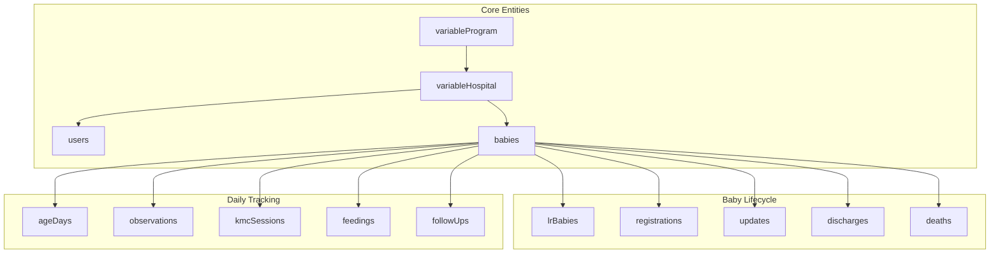

# First Embrace Database Schema Documentation

This document describes the database schema based on analysis of the example documents. The database appears to be a Firebase/Firestore database with document references using the `__ref__` pattern.

---

## Overview

The database consists of **14 collections** that track a Kangaroo Mother Care (KMC) program for low-birth-weight infants. The schema supports:
- Baby registration and lifecycle tracking
- Daily observations and health monitoring
- KMC (skin-to-skin) sessions and feeding records
- Discharge, follow-up, and death tracking
- Hospital and user management



---

## Collection Details

### 1. `variableProgram`

**Purpose**: Top-level program configuration. Parent collection for hospitals.

| Field | Type | Description |
|-------|------|-------------|
| `lastUID` | number | Last assigned UID counter |
| `programName` | string | Program identifier (e.g., "FE") |

---

### 2. `variableHospital`

**Purpose**: Hospital configuration and settings. Links to program and contains user references.

| Field | Type | Description |
|-------|------|-------------|
| `hospitalName` | string | Display name of the hospital |
| `idVariableProgram` | reference | Links to `variableProgram/{id}` |
| `appVersion` | number | Current app version for hospital |
| `activeUsers` | array | Array of `{userID: ref, userName: string}` objects |
| `locationsBaby` | array | Available baby locations `[{name, type}]` |
| `locationsMother` | array | Available mother locations `[{name, type}]` |
| `linkToGdrive` | string | Google Drive folder link |
| `totalBabyLabourRoom` | number | Count of babies in labour room |
| `whatsAppGroupLinkIP` | string | WhatsApp group link for IPs |
| `whatsAppGroupLinkNurses` | string | WhatsApp group link for nurses |

**Location Types**: `PNC`, `SNCU_NICU`, `MNCU`

---

### 3. `users`

**Purpose**: User accounts (nurses, admins, doctors).

| Field | Type | Description |
|-------|------|-------------|
| `display_name` | string | User's display name |
| `email` | string | User email address |
| `phone_number` | string | Phone number (optional) |
| `photo_url` | string | Profile photo URL |
| `role` | number | Role level (e.g., 6 = admin) |
| `hospitalID` | reference | Links to `variableHospital/{id}` |
| `hospitalName` | string | Hospital name (denormalized) |
| `userActive` | boolean | Whether user account is active |
| `userBio` | string | User biography |
| `acceptToS` | boolean | Terms of Service accepted |
| `created_time` | timestamp | Account creation time (`__time__` format) |
| `last_login` | number | Unix timestamp of last login |
| `currentAppVersion` | number | Current app version user is on |
| `platform` | string | Platform (e.g., "web") |
| `debugState` | boolean | Debug mode enabled |
| `fakeForms` | boolean | Using fake forms for testing |

---

### 4. `babies`

**Purpose**: Core baby record with current status. Central entity linking to all baby-related records.

| Field | Type | Description |
|-------|------|-------------|
| `UID` | string | Unique identifier |
| `motherName` | string | Mother's name |
| `birthDate` | number | Unix timestamp of birth |
| `hospitalID` | reference | Links to `variableHospital/{id}` |
| `hospitalName` | string | Hospital name (denormalized) |
| `assignedNurseID` | reference | Links to `users/{id}` |
| `assignedNurseName` | string | Nurse name (denormalized) |
| `babyInProgram` | boolean | Currently enrolled in KMC program |
| `discharged` | boolean | Has been discharged |
| `deadBaby` | boolean | Deceased status |
| `kmc` | boolean | Currently receiving KMC |
| `deletionRequested` | boolean | Marked for deletion |
| `lastLocationBaby` | string | Current location name |
| `lastLocationBabyType` | string | Location type |
| `lastDischargeDate` | number | Unix timestamp of last discharge |
| `lastDischargeStatus` | string | Status at discharge (`stable`, `critical`) |
| `lastDischargeType` | string | Discharge destination (`home`) |
| `babyVersion` | number | Version for conflict resolution |

---

### 5. `lrBabies` (Labour Room Babies)

**Purpose**: Initial baby identification from labour room before full registration.

| Field | Type | Description |
|-------|------|-------------|
| `lrSerialNumber` | string | Labour room serial number |
| `motherName` | string | Mother's name |
| `motherContactNumber` | string | Primary contact |
| `alternativeContactNumber` | string | Backup contact |
| `dateOfBirth` | number | Unix timestamp |
| `birthWeight` | string | Weight at birth (grams) |
| `birthWeightReason` | string | Reason if weight unavailable |
| `gestationalAgeDays` | number | Gestational age in days |
| `gestationalAgeDaysReason` | string | Reason if GA unavailable |
| `deliveryType` | string | Type (`normal`, `cesarean`) |
| `currentLocationOfTheBaby` | string | Current location |
| `hospitalID` | reference | Links to `variableHospital/{id}` |
| `hospitalName` | string | Hospital name (denormalized) |
| `identified` | boolean | Baby has been identified |
| `identificationStatus` | string | Status (`no_consent`, etc.) |
| `identifiedNurseID` | reference | Links to `users/{id}` |
| `identifiedNurseName` | string | Nurse name |
| `identifiedVersion` | number | Version number |
| `dangerSigns` | array | List of danger signs |
| `dangerSignsOther` | string | Other danger signs |
| `deathCauses` | array | Causes of death if applicable |
| `deathCausesOther` | string | Other death causes |
| `deathDate` | number | Unix timestamp (0 if alive) |
| `breastfedEarly` | string | Early breastfeeding status |
| `kmcEarly` | string | Early KMC status |
| `deletionRequested` | boolean | Marked for deletion |
| `notes` | string | Additional notes |
| `nurseID` | reference | Links to `users/{id}` |
| `nurseName` | string | Nurse name |
| `createdNurseID` | reference | Links to `users/{id}` |
| `createdNurseName` | string | Creator nurse name |
| `createdTime` | number | Unix timestamp |
| `createdVersion` | number | Version at creation |

---

### 6. `registrations`

**Purpose**: Full registration form when baby enters KMC program.

| Field | Type | Description |
|-------|------|-------------|
| `UID` | string | Unique identifier |
| `idBaby` | reference | Links to `babies/{id}` |
| `hospitalID` | reference | Links to `variableHospital/{id}` |
| `hospitalName` | string | Hospital name (denormalized) |
| `motherName` | string | Mother's name |
| `motherAge` | number | Mother's age |
| `numberMother` | string | Mother's phone number |
| `numberAlternative` | string | Alternative number |
| `numberAsha` | string | ASHA worker number |
| `street` | string | Address street |
| `village` | string | Village name |
| `villageCouncil` | string | Village council name |
| `aadharCardNumber` | string | Aadhar (ID) card number |
| `pctsID` | number | PCTS ID number |
| `gender` | string | Baby gender (`girl`, `boy`) |
| `birthType` | string | Delivery type (`normal`, `cesarean`) |
| `babyAmount` | string | Single/multiple (`single`, `twins`) |
| `birthLocation` | string | Birth location (`home`, `hospital`) |
| `birthLocationOther` | string | Other location details |
| `birthWeight` | number | Birth weight (grams) |
| `registrationWeight` | number | Weight at registration |
| `registrationTemperature` | number | Temperature at registration (°F) |
| `registrationRR` | number | Respiratory rate |
| `registrationRRTaken` | string | RR state (`awake`, `asleep`) |
| `registrationDate` | number | Unix timestamp |
| `registrationLocationBaby` | string | Baby location at registration |
| `registrationLocationBabyType` | string | Location type |
| `lastLocationMother` | string | Mother's location |
| `lastLocationMotherType` | string | Location type |
| `lastPeriodDate` | number | Last menstrual period (Unix) |
| `dangerSigns` | array | Danger signs at registration |
| `dangerSignsOther` | string | Other danger signs |
| `feedingProblemsBaby` | array | Baby feeding problems |
| `feedingProblemsMother` | array | Mother feeding problems |
| `complicationsMother` | array | Mother complications |
| `complicationsMotherOther` | string | Other complications |
| `admissionProblems` | array | Admission problems |
| `admissionProblemsOther` | string | Other admission problems |
| `treatments` | array | Treatments given |
| `treatmentsOther` | string | Other treatments |
| `doctor` | string | Doctor name |
| `recentlyVaccinated` | string | Vaccination status |
| `chatBotAccess` | boolean | ChatBot access granted |
| `notes` | string | Additional notes |
| `registrationNurseID` | reference | Links to `users/{id}` |
| `registrationNurseName` | string | Nurse name |
| `registrationVersion` | number | Version number |

---

### 7. `ageDays`

**Purpose**: Daily summary record for each baby per day of life.

| Field | Type | Description |
|-------|------|-------------|
| `UID` | string | Unique identifier |
| `idBaby` | reference | Links to `babies/{id}` |
| `hospitalID` | reference | Links to `variableHospital/{id}` |
| `hospitalName` | string | Hospital name (denormalized) |
| `ageDayNumber` | number | Day of life (1, 2, 3...) |
| `ageDayDate` | number | Unix timestamp for the day |
| `weight` | number | Weight on this day (grams) |
| `weightDate` | number | When weight was taken |
| `weightNurseID` | reference | Links to `users/{id}` |
| `weightNurseName` | string | Nurse name |
| `weightVersion` | number | Version number |
| `totalKMCToday` | number | Total KMC minutes today |
| `totalFeedingToday` | number | Total feeding minutes today |

---

### 8. `observations`

**Purpose**: Periodic health observations for babies.

| Field | Type | Description |
|-------|------|-------------|
| `UID` | string | Unique identifier |
| `idBaby` | reference | Links to `babies/{id}` |
| `hospitalID` | reference | Links to `variableHospital/{id}` |
| `hospitalName` | string | Hospital name (denormalized) |
| `motherName` | string | Mother's name |
| `ageDay` | number | Day of life |
| `observationNumber` | number | Observation sequence number |
| `observationDueDate` | number | When observation was due |
| `observationCompletedDate` | number | When completed |
| `completed` | boolean | Observation complete |
| `temperature` | number | Temperature reading (°F) |
| `RR` | number | Respiratory rate |
| `rrTaken` | string | RR state (`awake`, `asleep`) |
| `kmcStable` | string | KMC stability (`yes`, `no`) |
| `dangerSigns` | array | Observed danger signs |
| `dangerSignsOther` | string | Other danger signs |
| `recentlyVaccinated` | string | Vaccination status |
| `notes` | string | Observation notes |
| `verificationStatus` | string | Status (`todo`, `correct`, etc.) |
| `verificationNotes` | string | Verification notes |
| `observationNurseID` | reference | Links to `users/{id}` |
| `observationNurseName` | string | Nurse name |
| `observationVersion` | number | Version number |

**Danger Signs Values**: `fever`, `hypothermia`, `flaring_grunting`, `diarrhoea`, `severe_jaundice`, `other`, `none`

---

### 9. `kmcSessions`

**Purpose**: Individual Kangaroo Mother Care (skin-to-skin) sessions.

| Field | Type | Description |
|-------|------|-------------|
| `UID` | string | Unique identifier |
| `idBaby` | reference | Links to `babies/{id}` |
| `hospitalID` | reference | Links to `variableHospital/{id}` |
| `hospitalName` | string | Hospital name (denormalized) |
| `ageDay` | number | Day of life |
| `startTime` | string | Start time display (e.g., "1:00 AM") |
| `kmcStart` | number | Unix timestamp start |
| `kmcEnd` | number | Unix timestamp end |
| `kmcDuration` | number | Duration in minutes |
| `kmcProvider` | string | Who provided KMC (`mother`, `father`, etc.) |
| `kmcProviderOther` | string | Other provider details |
| `kmcWithFeeding` | string | Feeding during KMC (`yes`, `no`) |
| `notes` | string | Session notes |
| `verificationStatus` | string | Status (`todo`, `correct`) |
| `startNurseID` | reference | Links to `users/{id}` |
| `startNurseName` | string | Start nurse name |
| `endNurseID` | reference | Links to `users/{id}` |
| `endNurseName` | string | End nurse name |
| `kmcVersion` | number | Version number |

---

### 10. `feedings`

**Purpose**: Individual feeding sessions.

| Field | Type | Description |
|-------|------|-------------|
| `UID` | string | Unique identifier |
| `idBaby` | reference | Links to `babies/{id}` |
| `hospitalID` | reference | Links to `variableHospital/{id}` |
| `hospitalName` | string | Hospital name (denormalized) |
| `ageDay` | number | Day of life |
| `startTime` | string | Start time display |
| `feedingStart` | number | Unix timestamp start |
| `feedingEnd` | number | Unix timestamp end |
| `feedingDuration` | number | Duration in minutes |
| `feedMode` | string | Feeding mode (`breastfed`, `formula`, etc.) |
| `milkType` | string | Type of milk |
| `formulaReasons` | array | Reasons for formula use |
| `formulaReasonsOther` | string | Other formula reasons |
| `notes` | string | Feeding notes |
| `verificationStatus` | string | Status (`todo`, `correct`) |
| `feedingNurseID` | reference | Links to `users/{id}` |
| `feedingNurseName` | string | Nurse name |
| `feedingVersion` | number | Version number |

---

### 11. `updates`

**Purpose**: Status updates and alerts for babies.

| Field | Type | Description |
|-------|------|-------------|
| `UID` | string | Unique identifier |
| `idBaby` | reference | Links to `babies/{id}` |
| `hospitalID` | reference | Links to `variableHospital/{id}` |
| `hospitalName` | string | Hospital name (denormalized) |
| `updateType` | string | Type of update (`baby_unwell`, etc.) |
| `updateDate` | number | Unix timestamp |
| `dangerSigns` | array | Current danger signs |
| `dangerSignsOther` | string | Other danger signs |
| `notes` | string | Update notes |
| `updateNurseID` | reference | Links to `users/{id}` |
| `updateNurseName` | string | Nurse name |
| `updateVersion` | number | Version number |

---

### 12. `discharges`

**Purpose**: Discharge records when baby leaves hospital care.

| Field | Type | Description |
|-------|------|-------------|
| `UID` | string | Unique identifier |
| `idBaby` | reference | Links to `babies/{id}` |
| `hospitalID` | reference | Links to `variableHospital/{id}` |
| `hospitalName` | string | Hospital name (denormalized) |
| `dischargeNumber` | number | Discharge sequence (for readmissions) |
| `dischargeDate` | number | Unix timestamp |
| `dischargeType` | string | Destination (`home`, `referral`) |
| `dischargeReason` | string | Reason (`stable`, `LAMA`) |
| `dischargeStatus` | string | Status (`stable`, `critical`) |
| `dischargeWeight` | number | Weight at discharge (grams) |
| `dischargeTemperature` | number | Temperature (°F) |
| `dischargeRR` | number | Respiratory rate |
| `dischargeRRTaken` | string | RR state |
| `criticalReasons` | array | Reasons if critical |
| `dischargeDangerSigns` | array | Danger signs at discharge |
| `dischargeDangerSignsOther` | string | Other danger signs |
| `feedMode` | array | Current feeding modes |
| `milkType` | array | Milk types |
| `formulaReasons` | array | Formula reasons |
| `formulaReasonsOther` | string | Other formula reasons |
| `vaccinations` | array | Vaccinations given |
| `recentlyVaccinated` | string | Recent vaccination status |
| `itemsGiven` | array | Items given (`tempwatch`, `sling`, `cap`) |
| `convincedMother` | array | Who convinced mother (`doctor`, etc.) |
| `whyLama` | array | LAMA reasons |
| `whyLamaOther` | string | Other LAMA reasons |
| `notes` | string | Discharge notes |
| `dischargeCompletionTime` | number | Time to complete form |
| `assignedNurseID` | reference | Links to `users/{id}` |
| `assignedNurseName` | string | Nurse name |
| `dischargeNurseID` | reference | Links to `users/{id}` |
| `dischargeNurseName` | string | Nurse name |
| `dischargeVersion` | number | Version number |

**LAMA**: "Left Against Medical Advice"

---

### 13. `followUps`

**Purpose**: Post-discharge follow-up visits (home or hospital).

| Field | Type | Description |
|-------|------|-------------|
| `UID` | string | Unique identifier |
| `idBaby` | reference | Links to `babies/{id}` |
| `hospitalID` | reference | Links to `variableHospital/{id}` |
| `hospitalName` | string | Hospital name (denormalized) |
| `motherName` | string | Mother's name |
| `followUpNumber` | number | Follow-up sequence number |
| `followUpType` | string | Type (`home`, `hospital`) |
| `followUpStatus` | string | Status (`completed`, `pending`) |
| `followUpDueDate` | number | When follow-up was due |
| `followUpCompletedDate` | number | When completed (0 if pending) |
| `followUpCompletionTime` | number | Time to complete |
| `followUpCritical` | boolean | Critical status |
| `followUpWeight` | number | Weight at follow-up |
| `followUpWeightDate` | number | When weight taken |
| `visitDate` | number | Actual visit date |
| `whoInterviewed` | string | Who was interviewed (`mother`) |
| `whoVisited` | string | Who visited (`nobody`, `asha`) |
| `unreachable` | boolean | Could not reach family |
| `motherStatus` | string | Mother's status (`well`, etc.) |
| `reasonAbsenceMother` | string | Reason if mother absent |
| `familyCooperative` | boolean | Family cooperation |
| `dangerSigns` | array | Observed danger signs |
| `dangerSignsOther` | string | Other danger signs |
| `dayFeedingCount` | number | Day feedings count |
| `nightFeedingCount` | number | Night feedings count |
| `foodTypesToday` | array | Food types today |
| `foodTypesTodayOther` | string | Other food types |
| `foodTypesSinceBirth` | array | Food types since birth |
| `foodTypesSinceBirthOther` | string | Other food types |
| `feedingProblemsBaby` | array | Baby feeding problems |
| `feedingProblemsMother` | array | Mother feeding problems |
| `feedingProblemsOther` | string | Other problems |
| `kmcHoursCount` | number | Daily KMC hours |
| `kmcHoursReasons` | array | Reasons for low KMC |
| `kmcHoursReasonsOther` | string | Other reasons |
| `slingUsed` | string | Sling used (`yes`, `no`) |
| `slingReasons` | array | Reasons sling not used |
| `slingReasonsOther` | string | Other reasons |
| `tempwatchUsed` | string | Temperature watch used |
| `tempwatchReasons` | array | Reasons not used |
| `tempwatchReasonsOther` | string | Other reasons |
| `itemsUsed` | array | Items being used (`cap`, etc.) |
| `watchVideos` | string | Watched educational videos |
| `visitHospitalReasons` | array | Reasons to visit hospital |
| `visitHospitalReasonsOther` | string | Other reasons |
| `visitHospitalResult` | string | Hospital visit outcome |
| `notes` | string | Follow-up notes |
| `followUpNurseID` | reference | Links to `users/{id}` |
| `followUpNurseName` | string | Nurse name |
| `followUpVersion` | number | Version number |

---

### 14. `deaths`

**Purpose**: Death records for deceased babies.

| Field | Type | Description |
|-------|------|-------------|
| `UID` | string | Unique identifier |
| `idBaby` | reference | Links to `babies/{id}` |
| `hospitalID` | reference | Links to `variableHospital/{id}` |
| `hospitalName` | string | Hospital name (denormalized) |
| `motherName` | string | Mother's name |
| `deathDate` | number | Unix timestamp of death |
| `deathCompletedDate` | number | When form completed |
| `deathCompletionTime` | number | Form completion time |
| `deathWeight` | number | Weight at death (grams) |
| `deathLocation` | string | Location of death |
| `deathLocationOther` | string | Other location |
| `deathLocationPC` | string | Primary care location |
| `deathLocationPCOther` | string | Other PC location |
| `deathCauses` | array | Causes of death |
| `deathCausesOther` | string | Other causes |
| `deathCausesPC` | array | Primary contributing causes |
| `deathCausesPCOther` | string | Other PC causes |
| `deathHistory` | string | Death history narrative |
| `doctorComment` | string | Doctor's comments |
| `shownToDoctor` | boolean | Case shown to doctor |
| `deathNurseID` | reference | Links to `users/{id}` |
| `deathNurseName` | string | Nurse name |
| `deathVersion` | number | Version number |

**Death Causes**: `milk_aspiration`, `extreme_prematurity`, `sepsis`, `respiratory_failure`, etc.

---

## Key Relationships

### Reference Pattern
All references use the format:
```json
{
  "__ref__": "collection/documentId"
}
```

### Primary Relationships

| From Collection | To Collection | Via Field | Cardinality |
|-----------------|---------------|-----------|-------------|
| `variableHospital` | `variableProgram` | `idVariableProgram` | Many:1 |
| `users` | `variableHospital` | `hospitalID` | Many:1 |
| `babies` | `variableHospital` | `hospitalID` | Many:1 |
| `babies` | `users` | `assignedNurseID` | Many:1 |
| `registrations` | `babies` | `idBaby` | 1:1 |
| `lrBabies` | `variableHospital` | `hospitalID` | Many:1 |
| `ageDays` | `babies` | `idBaby` | Many:1 |
| `observations` | `babies` | `idBaby` | Many:1 |
| `kmcSessions` | `babies` | `idBaby` | Many:1 |
| `feedings` | `babies` | `idBaby` | Many:1 |
| `updates` | `babies` | `idBaby` | Many:1 |
| `discharges` | `babies` | `idBaby` | Many:1 |
| `followUps` | `babies` | `idBaby` | Many:1 |
| `deaths` | `babies` | `idBaby` | 1:1 |

### Nurse References
Most collections include nurse references for audit purposes:
- `*NurseID` → Reference to `users/{id}`
- `*NurseName` → Denormalized nurse name

---

## Data Patterns

### Versioning
All collections include a `*Version` field (e.g., `babyVersion`, `registrationVersion`) for optimistic concurrency control, currently at version **338**.

### Denormalization
Hospital and nurse names are denormalized throughout for query efficiency:
- `hospitalName` appears in most collections
- `*NurseName` accompanies `*NurseID` references

### Timestamps
- Unix timestamps (seconds since epoch) for most date fields
- Special `__time__` format for some timestamp fields in users

### Arrays for Multi-Select
Multiple selection fields use arrays:
- `dangerSigns`, `feedingProblemsBaby`, `deathCauses`, etc.
- Corresponding `*Other` string field for custom values

---

## Common Field Values

### Danger Signs
`none`, `fever`, `hypothermia`, `flaring_grunting`, `diarrhoea`, `severe_jaundice`, `other`

### Location Types
`PNC`, `SNCU_NICU`, `MNCU`

### Discharge Status
`stable`, `critical`

### Discharge Types
`home`, `referral`

### Feed Modes
`breastfed`, `formula`, `mixed`

### KMC Providers
`mother`, `father`, `grandmother`, `other`
